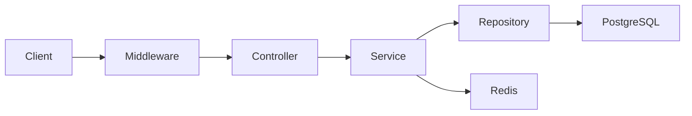

# Distributed Payment Ledger

A production-style backend payment ledger API built with **Node.js**, **TypeScript**, **Express**, **PostgreSQL**, and **Redis**.

This project simulates core payment infrastructure concepts found in real-world payment systems by focusing on transactional integrity, idempotent request handling, concurrency control, and immutable double-entry accounting.

Unlike a simple CRUD application, this project emphasizes backend engineering practices such as ACID transactions, row-level locking, Redis-backed idempotency, clean architecture, and comprehensive automated testing.

## Features

- Production-style layered architecture
- Double-entry accounting ledger
- Immutable ledger entries
- ACID database transactions
- PostgreSQL row-level locking (`FOR UPDATE`)
- Redis-backed idempotency
- Atomic request locking using `SET NX EX`
- Duplicate payment prevention
- Balance validation
- Global error handling
- Request validation using Zod
- Structured logging with Pino
- Swagger/OpenAPI documentation
- Dockerized PostgreSQL and Redis
- Unit and Integration tests
- Concurrency testing

## Tech Stack

| Category | Technology |
|----------|------------|
| Language | TypeScript |
| Runtime | Node.js |
| Framework | Express.js |
| Database | PostgreSQL |
| Cache | Redis |
| Validation | Zod |
| Logging | Pino |
| Testing | Jest + Supertest |
| Documentation | Swagger (OpenAPI) |
| Containerization | Docker & Docker Compose |

## Architecture

